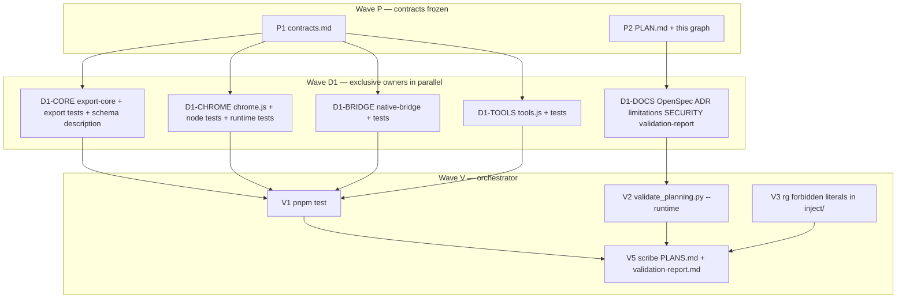

# Hyperfine task graph — RV-R-001–011

## Microtasks

| ID | Owner files | Depends | Parallel | Acceptance | Do not touch |
| --- | --- | --- | --- | --- | --- |
| P1 | `docs/planning/review-hardening/contracts.md` | — | with P2 | Frozen codes, hosts, emitStatus home | inject/, tests/ |
| P2 | `PLAN.md`, `task-graph.md` | — | with P1 | Critique recorded; extras listed | inject/ |
| D1-CORE-001 | `inject/export-core.js` `isAllowedMediaUrl` / `mediaUrlDecision` | P1 | yes | Allowlist + reasons; no forbidden literals | chrome.js |
| D1-CORE-001b | same + tests | D1-CORE-001 | same agent | Parametrized host/path/redirect/`res.url` tests; default fetch mocks include `url` | chrome.js |
| D1-CORE-002 | `collectAndFetchMedia` deadline/race | P1 | same agent | Injectable timers; abort in-flight; hang-first duplicate intact | chrome.js |
| D1-CORE-008 | `emitStatus` | P1 | same agent | Dispatch window only; document fallback only if no window | chrome.js |
| D1-CORE-009 | `saveZip` `files` | P1 | same agent | `Object.keys(zip.files)`; FakeZip capture; grouped-or assertion gone | chrome.js |
| D1-CORE-010 | `collectVisibleFileCards` CSS-hidden | P1 | same agent | Hidden cards omitted; 0×0 rect still collected; workflow `visible-dom` | chrome.js |
| D1-CORE-SCH | `schemas/export-manifest.schema.json` | P1 | same agent | Enum unchanged; description clarifies mounted-DOM | export-core builder shape |
| D1-CHR-004 | `inject/chrome.js` observer filter | P1 | yes | Chrome-only mutations ignored; provider childList still coalesces | export-core.js |
| D1-CHR-005 | `findSidebar` | P1 | same agent | Resolved decoy falls through; bounds 120/40/280 exclusive | selectors.js |
| D1-CHR-006 | `unmountMinimap` | P1 | same agent | Safe-mode onChange removes minimap | export.js |
| D1-CHR-007 | `isTypingTarget` | P1 | same agent | Exported; shortcuts skipped in composer; Escape still works | tools.js |
| D1-CHR-008 | `onExportStatus` | P1 | same agent | Ignore `target !== window`; unhide before text | export-core.js |
| D1-CHR-A11Y | palette input combobox | P1 | same agent | `aria-activedescendant` on input | selectors.js |
| D1-CHR-TEST-N | `inject/chrome.test.js` | helpers on api | same agent | Boot guard holds; helper unit tests | happy-dom import of chrome.js in this file |
| D1-CHR-TEST-D | `tests/inject/chrome.runtime.test.js` | boot | same agent | Safe-mode unmount + duplicate status | export-core.js |
| D1-BRG-003 | `inject/native-bridge.js` | P1 | yes | Extra keys rejected; `bytes` forbidden; `conversation.json` filename rejected | export-core.js |
| D1-BRG-TEST | `tests/inject/native-bridge.test.js` | D1-BRG-003 | same agent | Host not called; existing fallback tests remain | chrome.js |
| D1-TLS-CAT | `inject/tools.js` | P1 | yes | Frozen catalog; copy-on-read | chrome.js |
| D1-TLS-DIAG | same | P1 | same agent | `diagnostics_unavailable` is `ok: false` | diagnostics.js |
| D1-DOC-011 | OpenSpec/ADR/limitations/SECURITY/validation-report | P2 | yes | Bytes-only invalid; TASK-043 three codes; 65+10 tests; native honesty | `PLANS.md` PASS tables, `pake.json` |
| V1 | — | all D1 code | after D1 | `pnpm test` green | code edits unless fail |
| V2 | — | D1-DOC | with V1 | `--runtime` PASS | install jsonschema |
| V3 | — | D1-CORE | with V1 | `rg` inject forbidden literals = 0 | tests/docs hits are allowed |
| V5 | `PLANS.md`, `validation-report.md` | V1–V3 | last | Paste executed output only | inventing PASS |

## Merge hazards

- **Status event:** two owners (`emitStatus` vs listener). Contracts freeze the split; do not move the function.
- **Skip reasons:** chrome formatter may show raw codes for new media reasons — acceptable; do not expand `formatExportStatus` in this change unless already editing that switch for another reason.
- **Schema enum:** keep `visible-dom`.
- **Pake inject lists:** do not touch.
- **PLANS.md:** single writer at V5.
- **chrome boot:** Node `require` must not boot; Vitest runtime file may boot in happy-dom only.

## Agent preamble (verbatim)

1. Modify **only** the owner file set. Any other path in the diff is a failure.
2. Classic IIFE; match existing dialect in that file.
3. No `pnpm install` / lockfile / `pake:install`.
4. No forbidden endpoint literals in `inject/`.
5. Every `fetch` uses `credentials: "omit"`; media fetch also `redirect: "error"`.
6. Do not rename `Cwa*` globals, boot flags, or event names.
7. Do not write PASS into `PLANS.md`.
8. Fixtures contain no real cookies, tokens, or private conversations.
